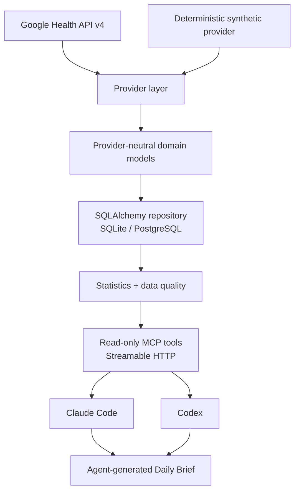

# Google Health Agent

Google Health data pipeline and MCP server for AI agent analysis with Claude Code and Codex.

> **Public Architecture / Demo Phase:** the public repository uses only deterministic
> **SYNTHETIC DATA**. It contains no personal health records, credentials, tokens, server
> addresses, or account information.

[中文说明](README.zh-CN.md)

## What it is

Google Health Agent is a local-first, self-hosted, read-only data and statistics layer:

```text
Google Health → normalized self-hosted data → MCP → Claude Code / Codex
```

The service owns facts: source metadata, normalized observations, mathematical summaries,
period comparisons, transparent anomalies, and data-quality warnings. The external agent owns
interpretation. The core package does not import Anthropic or OpenAI SDKs.

## What it is not

- Not a medical device, diagnosis system, or source of medical advice.
- Not a chatbot or a backend that writes health conclusions.
- Not a hosted SaaS or telemetry platform.
- Not the legacy Fitbit Web API.

## Architecture



The dependency direction is `Provider → Domain → Storage → Analytics → MCP → Agent`. See
[architecture](docs/architecture.md) and [prior-art decisions](docs/prior-art.md).

## Five-minute synthetic demo

Requirements: Python 3.12+ and [uv](https://docs.astral.sh/uv/).

```bash
uv sync
uv run healthctl demo
uv run healthctl doctor
uv run healthctl serve
```

The first command creates 120 days of deterministic, visibly labelled synthetic observations
in the gitignored `data/demo.sqlite`. The MCP endpoint is
`http://127.0.0.1:8000/mcp`; probes are `/healthz` and `/readyz`.

In another terminal:

```bash
uv run healthctl analytics --metric hrv --days 30
uv run healthctl brief --agent fake --dry-run
uv run healthctl brief --agent fake
```

The last command exercises the official MCP client, writes a gitignored Markdown report, and
uses the console mailer. It neither calls a model nor sends email.

## MCP tools

All tools are read-only, structured, bounded to at most 365 days, and include relevant data
quality/source metadata.

| Tool | Purpose |
| --- | --- |
| `get_health_overview` | Aggregated sleep, recovery, activity, trends, quality, and sources |
| `get_sleep` | Sleep totals, timing, stages, history, and summary |
| `get_recovery` | HRV, resting heart rate, SpO2, respiratory rate, temperature |
| `get_activity` | Deduplicated steps, active/sedentary minutes, exercise, sources |
| `get_metric` | Bounded daily history or summary for one metric |
| `compare_periods` | Median/difference/sample-count comparison of explicit periods |
| `get_data_quality` | Missing days, source/timezone changes, and overlap warnings |
| `get_daily_brief_context` | Compact facts for an agent-generated morning brief |

The server uses the official MCP Python SDK and Streamable HTTP, not legacy HTTP+SSE. Debug it
with the current MCP Inspector:

```bash
npx -y @modelcontextprotocol/inspector
```

Then connect the Inspector to `http://127.0.0.1:8000/mcp`.

## Claude Code

Claude Code supports environment expansion in project `.mcp.json` files. Copy the reviewed
example and set the endpoint. For authenticated deployments also set the token:

```bash
cp examples/claude/.mcp.json.example .mcp.json
export HEALTH_MCP_URL=http://127.0.0.1:8000/mcp
export HEALTH_MCP_TOKEN=
claude mcp list
```

Alternatively, use the current CLI:

```bash
claude mcp add --transport http google-health-agent http://127.0.0.1:8000/mcp
```

See [Claude Code setup](docs/claude-code.md) and the
[official Claude Code MCP documentation](https://docs.anthropic.com/en/docs/claude-code/mcp).

## Codex

Copy the table from `examples/codex/config.toml.example` into project or user Codex config.
Codex currently accepts a literal Streamable HTTP `url` and reads the bearer token from the
named environment variable:

```toml
[mcp_servers.google_health_agent]
url = "http://127.0.0.1:8000/mcp"
bearer_token_env_var = "HEALTH_MCP_TOKEN"
```

The URL itself is literal TOML; environment-variable expansion for `url` is not used here.
For an unauthenticated localhost demo, add the server with the current CLI instead:

```bash
codex mcp add google_health_agent --url http://127.0.0.1:8000/mcp
```

See [Codex setup](docs/codex.md) and the
[official Codex MCP documentation](https://developers.openai.com/codex/mcp/).

## Daily Brief

`healthctl brief` gives an installed Claude Code or Codex CLI a small task prompt and expects
the agent to retrieve facts through MCP. It does not inject a database dump into the prompt.

```bash
uv run healthctl brief --agent claude --dry-run
uv run healthctl brief --agent codex --dry-run
```

Dry-run prints only the agent, MCP endpoint, task, expected output, and mailer. FakeRunner
provides a no-model CI demonstration. See [Daily Brief](docs/daily-brief.md).

## Google Health

The disabled-by-default production provider uses `https://health.googleapis.com/v4`, Google
OAuth Web Server Authorization Code Flow with offline access, and only these scopes:

- `googlehealth.sleep.readonly`
- `googlehealth.health_metrics_and_measurements.readonly`
- `googlehealth.activity_and_fitness.readonly`

Phase 1 includes request construction, pagination, retry/backoff, refresh, encrypted token
storage, normalization, and mocked tests. It never authorizes a real account. Real credentials
and data belong only in the future Private Deployment Phase. See
[Google Health](docs/google-health.md).

## Security and privacy

Defaults are local-first, self-hosted, read-only, minimal exposure, synthetic public tests, and
no telemetry. Non-loopback binding requires Bearer authentication. OAuth and MCP tokens are
never returned by tools or included in normal logs. Run:

```bash
uv run python scripts/secret_scan.py
```

Read [security design](docs/security.md), [SECURITY.md](SECURITY.md), and
[private deployment planning](docs/private-deployment.md).

## Docker

```bash
docker compose -f compose.demo.yml up --build
```

The demo publishes only `127.0.0.1:8000`, uses synthetic data, and automatically configures a
non-secret demo-only container token. Production examples contain environment substitutions
only and are documentation, not a deployment action.

## Development

```bash
uv sync
uv run ruff check .
uv run ruff format --check .
uv run mypy src/google_health_agent
uv run pytest
uv run python scripts/secret_scan.py
```

See [CONTRIBUTING.md](CONTRIBUTING.md). Tests never contact Google Health or a real model.

## Roadmap

1. Phase 1 — Synthetic data, MCP, and agent architecture.
2. Phase 2 — Private Google Health deployment.
3. Phase 3 — Automated daily agent brief.
4. Phase 4 — Additional health providers.

## License

MIT. See [LICENSE](LICENSE).

